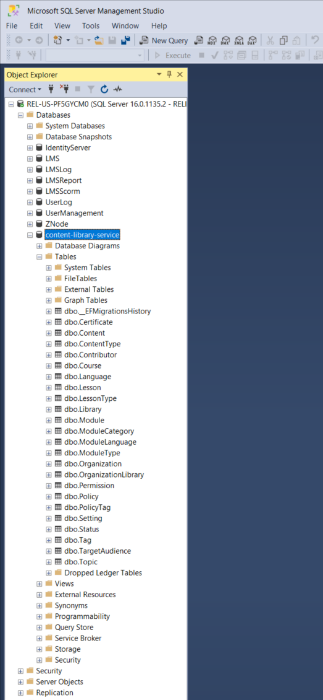
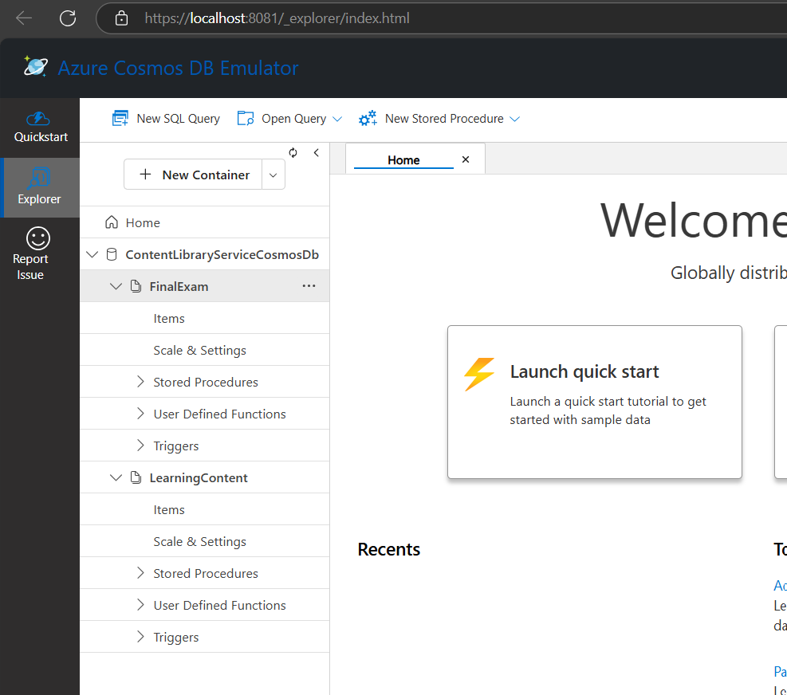

# Content Library Service - with CQRS pattern

Content Library Service for Target infrastructure.

**Note: This service implements the Command Query Responsibility Segregation (CQRS) pattern.**

---

## Table of Contents
- [Content Library Service - with CQRS pattern](#content-library-service---with-cqrs-pattern)
  - [Table of Contents](#table-of-contents)
  - [Local Development Setup](#local-development-setup)
    - [1. SQL Server Setup](#1-sql-server-setup)
    - [2. Azure Cosmos DB Emulator Setup](#2-azure-cosmos-db-emulator-setup)
    - [3. Azure Service Bus Setup](#3-azure-service-bus-setup)
    - [4. Azure Blob Storage Emulator Setup](#4-azure-blob-storage-emulator-setup)
  - [Running the Services](#running-the-services)
  - [Swagger API Documentation](#swagger-api-documentation)

---

## Local Development Setup

> **Important:** Before proceeding, ensure you have completed the [initial developer workstation setup](https://engineering.reliaslearning.com/developer-documentation/docs/onboarding/developer-workstation-setup.html) which will guide you through installing SQL Server, SQL Server Management Studio, and setting up the required Azure Service Bus.

To run the service locally, you'll need to set up three main components:

1. SQL Server
2. Azure Cosmos DB Emulator
3. Azure Service Bus connection
4. Azure Blob Storage Emulator

### 1. SQL Server Setup

**Creating the SQL Database**

1. Navigate to the repository root directory in your terminal (e.g., C:\Development\content-library-service).

2. Run the following command to create the database and apply all migrations:
   ```powershell
   dotnet ef database update --project src/Relias.ContentLibraryService.Infra --startup-project src/Relias.ContentLibraryService.Api
   ```

3. Verify the database was created successfully in SQL Server Management Studio or Azure Data Studio.




**Reference: Connection String Information**

The SQL Server connection string should already be preconfigured in the application settings development JSON files. If you run into SQL connection issues during the database creation or have a non-default configuration, you can refer to the information below.
   
The default configuration uses:

```
"SqlServerConnectionString": "Server=.;Database=content-library-service;Trusted_Connection=True;TrustServerCertificate=True;"
```

If you need to modify the connection string:

**Option 1**: Edit the application settings files directly
- Edit `src/Relias.ContentLibraryService.Api/appsettings.Development.json`
- Edit `src/Relias.ContentLibraryService.Consumer/appsettings.Development.json`

**Option 2**: Override using .NET user secrets
```powershell
dotnet user-secrets set "SqlServerConnectionString" "Server=.;Database=content-library-service;Trusted_Connection=True;TrustServerCertificate=True;" --project src/Relias.ContentLibraryService.Api

dotnet user-secrets set "BaseSettings:SqlServerConnectionString" "Server=.;Database=content-library-service;Trusted_Connection=True;TrustServerCertificate=True;" --project src/Relias.ContentLibraryService.Consumer
```

**Reference: Installing Entity Framework Core CLI tools**

You should already have Entity Framework Core CLI tools from the initial developer workstation setup. If for some reason that is not the case you can install them using:
   ```powershell
   dotnet tool install --global dotnet-ef
   ```

### 2. Azure Cosmos DB Emulator Setup

1. **Install Azure Cosmos DB Emulator**

   **Install from Intune Company Portal**
   - Open the Intune Company Portal on your company device
   - Search for "Azure Cosmos DB Emulator"
   - Download and install the Azure Cosmos DB Emulator
   - Follow the installation instructions

2. **Run the Cosmos DB Emulator**

   - Run the emulator with administrator permissions from the Start menu

3. **Create Required Database and Containers**

   Create manually through the web interface:
   - Access the Cosmos DB Emulator web interface: https://localhost:8081/_explorer/index.html
   - Create a database named `ContentLibraryServiceCosmosDb`
   - In that database, create these containers:
     - `FinalExam` (partition key: `/courseId`)
     - `LearningContent` (partition key: `/courseId`)
     

4. **Cosmos DB Connection Configuration**
   
   The Cosmos DB connection should already be preconfigured in the API project's appsettings.Development.json file. The default configuration uses:

   ```json
   "CosmosRepositoryOptions": {
     "CosmosConnectionString": "AccountEndpoint=https://localhost:8081/;AccountKey=C2y6yDjf5/R+ob0N8A7Cgv30VRDJIWEHLM+4QDU5DE2nQ9nDuVTqobD4b8mGGyPMbIZnqyMsEcaGQy67XIw/Jw==;",
     "DatabaseId": "ContentLibraryServiceCosmosDb",
     "AccountEndpoint": null
   }
   ```

   If you need to modify the connection:

   **Option 1**: Edit the appsettings file directly
   - Edit `src/Relias.ContentLibraryService.Api/appsettings.Development.json`   
   
   **Option 2**: Override using .NET user secrets
   ```powershell
   dotnet user-secrets set "CosmosRepositoryOptions:CosmosConnectionString" "AccountEndpoint=https://localhost:8081/;AccountKey=C2y6yDjf5/R+ob0N8A7Cgv30VRDJIWEHLM+4QDU5DE2nQ9nDuVTqobD4b8mGGyPMbIZnqyMsEcaGQy67XIw/Jw==;" --project src/Relias.ContentLibraryService.Api
   dotnet user-secrets set "CosmosRepositoryOptions:DatabaseId" "ContentLibraryServiceCosmosDb" --project src/Relias.ContentLibraryService.Api
   ```

   **Note:** The default master key for the emulator is: C2y6yDjf5/R+ob0N8A7Cgv30VRDJIWEHLM+4QDU5DE2nQ9nDuVTqobD4b8mGGyPMbIZnqyMsEcaGQy67XIw/Jw==

### 3. Azure Service Bus Setup

1. **Service Bus Connection Configuration**

   To configure the connection:

   ```powershell
   # Set the connection string for the Consumer project
   dotnet user-secrets set "BaseSettings:ServiceBusConnectionString" "[your service bus connection string]" --project src/Relias.ContentLibraryService.Consumer
   
   # Set Azure Tenant ID
   dotnet user-secrets set "AZURE_TENANT_ID" "838dd0ab-c484-4619-ac32-807ef6da0240" --project src/Relias.ContentLibraryService.Consumer
   ```   
   
   **Note:** If you're running against dev1, you will need the appropriate PIMS to access the service bus. There is a script at `.azuredevops\devtools\PIM\activate-dev1-reader.ps1` to request these on your behalf. Run it in PowerShell and authenticate in the browser.

### 4. Azure Blob Storage Emulator Setup

1. **Install Azure Blob Storage Emulator**

   **Install from Intune Company Portal**
   - Open the Intune Company Portal on your company device
   - Search for "Azure Blob Storage Emulator"
   - Download and install the Azure Blob Storage Emulator
   - Follow the installation instructions

2. **Run the Blob Storage Emulator**

   - Run the emulator from the Start menu

3. **Create Required Blob Containers**

   Create manually through the application:
   - In the left menu, `Emulator & Attached` -> `Storage Accounts` -> `Emulator` -> `Blob Containers`
   - Create a new container named `main`

## Running the Services

1. **Run the API**

   ```powershell
   cd src/Relias.ContentLibraryService.Api
   dotnet run
   ```
   
   The API will start at `https://localhost:55001` by default.

2. **Run the Consumer**

   ```powershell
   cd src/Relias.ContentLibraryService.Consumer
   dotnet run
   ```

3. **Verify Health**

   - API Health: `GET /api/HealthCheck`
   - Cosmos DB Health: `GET /api/CosmosHealthCheck`
   - Consumer Health: [https://localhost:50822/healthcheck](https://localhost:50822/healthcheck)

## Swagger API Documentation

Access Swagger UI at: [https://localhost:55001/swagger](https://localhost:55001/swagger)